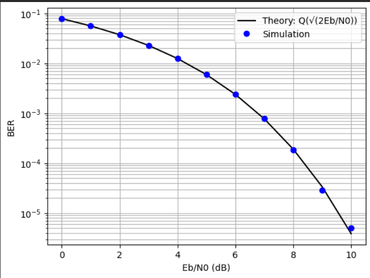
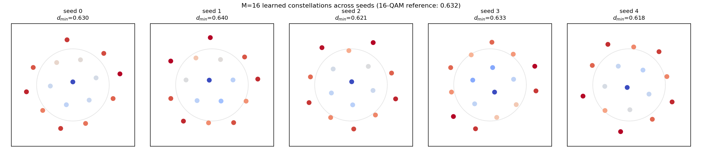

# Learned Physical Layer: Neural Networks Rediscover QPSK and Beat 16-QAM
 
An end-to-end neural communication system trained as an autoencoder over a noisy
channel. Given only a message to recover and an average transmit-power budget (no
knowledge of carriers, symbols, phase, or any modulation scheme), the network
designs its own constellation and its own receiver.
 
On AWGN with 4 messages it converges to QPSK, the known optimum. With 16 messages it
converges to a **centre point plus two rings (1 + 6 + 9)**, reproducibly across 5
seeds, and achieves **roughly half the symbol error rate of 16-QAM at 12 dB**
(about a 0.3 to 0.4 dB gain).
 
---
 
## 1. Background: a communication system is an autoencoder
 
A digital communication link is:
 
```
message m → transmitter → x → channel → r = x + n → receiver → m̂
```
 
An autoencoder is:
 
```
input → encoder → latent z → bottleneck → decoder → reconstruction
```
 
These are the same diagram. The transmitter is an encoder, the **constellation is
the latent space**, the channel is a *noisy* bottleneck, and the receiver is a
decoder. The training objective (recover the input at the output) is the
communication objective.
 
The move that makes this trainable: the AWGN channel `r = x + n` is
**differentiable**. Because `n` is sampled independently of `x`, autograd treats it
as an additive constant, so `∂r/∂x = 1`. The channel injects randomness in the
forward pass but does not block gradient flow in the backward pass. Gradients travel
from the receiver's loss, *through the physics of the channel*, into the
transmitter's weights.
 
---
 
## 2. Setup
 
**Classical baseline (implemented first, in `src/baselines.py`).**
1M random bits → Gray-mapped to QPSK symbols (bit `0 → +1`, `1 → −1` on each of I
and Q), normalized so `Es = 1` → AWGN channel → nearest-neighbour detection → BER.
Simulated BER matches the theoretical `Q(√(2Eb/N₀))` curve, which validates the
transmitter, channel, and receiver before any learning is introduced.
 
Noise calibration used throughout:
 
```
Es = 1  →  Eb = Es / k  →  N₀ = Eb / (Eb/N₀)  →  σ² = N₀ / 2  per real dimension
```
 
**Learned system (`src/models.py`).**
 
| Stage | Object | Shape |
|---|---|---|
| Message | `m ∈ {0, …, M−1}` | scalar |
| One-hot `s` | selector, *not* a probability | `M` |
| Encoder MLP | transmitter | `M → 64 → 2·n_ch` |
| Power normalization | `E[‖x‖²] = n_ch` | n/a |
| Channel | `r = x + n` | `2·n_ch` |
| Decoder MLP | receiver | `2·n_ch → 64 → M` |
| Softmax | posterior `P(m ∣ r)` | `M` |
 
Trained end-to-end with cross-entropy (Adam, cosine learning-rate schedule, fresh
messages and fresh noise every batch). A single optimizer holds **both** networks'
parameters: transmitter and receiver are co-designed rather than standardized
separately.
 
### Three details that carry all the physics
 
**Why one-hot, not the integer `m`.** `Linear(1, ·)` computes `w·m + b`, which forces
message 2 to produce twice the pre-activation of message 1: a false ordering and a
false metric on what are arbitrary categorical labels. With a one-hot input,
`Linear(M, ·)` instead *selects a column* of the weight matrix, making the first layer
a learnable lookup table: M free vectors, one per message. That is exactly what
designing a constellation means.
 
**Why the power constraint is the problem.** Without `E[‖x‖²] = 1`, the network
discovers it can defeat any noise by transmitting with unbounded amplitude. It does:
training loss collapses to `0.0000` (see §5). Real transmitters have batteries,
saturating amplifiers, and regulators. The constellation that emerges is the
**equilibrium between two opposing forces**: spread points far apart to minimize
confusion, but stay within a fixed energy budget. Remove the budget and the problem
evaporates. Note that the constraint is on the *average* energy, so individual points
may sit inside or outside the unit circle; the M = 16 result depends on this freedom.
 
**Why cross-entropy is the *correct* loss, not a default.** The decoder's softmax is
an estimate `q(m ∣ r)` of the posterior, and classical detection theory proves the
optimal receiver is the MAP detector: `argmax_m P(m ∣ r)`. Cross-entropy decomposes as
 
```
CE = H(M | R) + E_r[ KL( P(· ∣ r) ‖ q(· ∣ r) ) ]
```
 
The KL term vanishes only when the softmax equals the true posterior, so the trained
decoder **is a learned MAP detector**, the same object the textbook prescribes,
reached by gradient descent instead of algebra. Its learned decision regions are the
Voronoi cells of the constellation. The first term depends on the transmitter: since
`I(M; R) = H(M) − H(M | R) ≥ k − CE` (CE in bits), training also pushes the
transmitter to maximize a lower bound on the mutual information carried by the
channel.
 
---
 
## 3. Results
 
### 3.0 Classical baseline: simulation matches theory
 

 
Simulated QPSK BER (1M bits, nearest-neighbour detection) sits on the analytical
`Q(√(2Eb/N₀))` curve across 0 to 10 dB. This validates the transmitter, channel
model, and noise calibration before any learning is introduced. Every result below is
measured against this verified pipeline.
 
*(Note the scatter at 9 to 10 dB: at BER ≈ 10⁻⁵ only a handful of errors occur in
10⁶ bits, so the Monte-Carlo estimate is noisy. Reliable estimates require counting
errors, not bits.)*
 
### 3.1 AWGN, M = 4: QPSK is rediscovered
 

 
| Metric | Learned | Classical optimum |
|---|---|---|
| Mean symbol energy `E[‖x‖²]` | 1.000 | 1.000 (the constraint) |
| Minimum distance | ≈ 1.41 | √2 = 1.414 (QPSK) |
 
Four points, unit circle, 90° apart: QPSK, up to a global rotation. The rotation is
irrelevant, since a constant phase offset is removed by carrier recovery in any real
receiver. The *geometry* is the result.
 
**The learned system does not beat classical QPSK on AWGN. It matches it.** This is
the expected and correct outcome: for 4 points on AWGN the classical solution is
optimal, so there is nothing to beat. The value of the experiment is that it
validates the method on a channel where ground truth is known.
 
`experiments/exp1_awgn_qpsk.py` also plots the learned BLER against QPSK theory and
the decoder's decision regions, which come out as the Voronoi cells of the learned
constellation.
 
**Gray coding does not emerge.** The learned labels place `00` adjacent to `11`.
Cross-entropy penalizes *message* errors, not *bit* errors, and the one-hot encoding
destroys bit structure: to the loss, all M messages are equidistant categories. The
network therefore has no incentive to place bit-adjacent patterns at
geometry-adjacent points. Classical QPSK uses Gray labelling precisely because a
symbol error flipping two bits costs twice as much as one flipping a single bit.
Recovering this behaviour requires a per-bit loss (see roadmap).
 
### 3.2 AWGN, M = 16: a reproducible 1 + 6 + 9 geometry that beats 16-QAM
 

 
Trained at 12 dB for 20,000 steps, across **5 random seeds** (16-point packing has
many local optima, so a single run proves nothing).
 
**Geometry.** Every seed converges to the same family: **one point near the origin**,
a middle ring of 6 points (7 for one seed) and an outer ring of 9 (8 for that seed).
Mean energy is exactly 1.000 in every run. A centre point surrounded by rings is a
hexagon-like packing, and hexagonal packing is the densest arrangement of points in
the plane, which is why it can outperform the square grid under an average-power
constraint.
 
**Minimum distance** (all constellations at unit average energy):
 
| Constellation | Minimum distance |
|---|---|
| **Learned, best seed** | **0.6398** |
| 16-QAM | 0.6325 |
| **Learned, mean of 5 seeds** | **0.6283 ± 0.0081** |
| APSK 5+11 (radius-optimized) | 0.6223 |
| APSK 6+10 (radius-optimized) | 0.5896 |
| 16-APSK 4+12 (DVB-S2 style, radius-optimized) | 0.5848 |
| 16-PSK | 0.3902 |
 
Minimum distance alone is close to a tie with 16-QAM. It is only a proxy: by the
union bound, `P(err) ≈ N_min · Q(d_min / 2σ)`, so the *number* of nearest neighbours
matters too.
 
**Symbol error rate, the metric that decides it** (500,000 messages per point;
16-QAM simulated through the same channel with nearest-neighbour detection):
 
| Eb/N₀ | Learned (best seed) | 16-QAM | 16-QAM needs | Gain |
|---|---|---|---|---|
| 8 dB | 0.0298 | 0.0366 | 8.30 dB | ≈ 0.30 dB |
| 10 dB | 0.00479 | 0.00707 | 10.36 dB | ≈ 0.36 dB |
| 12 dB | 0.000284 | 0.000578 | 12.41 dB | ≈ 0.41 dB |
| 14 dB | 0.000006 | 0.000016 | 14.25 dB | ≈ 0.25 dB |
 
"16-QAM needs" is the Eb/N₀ at which the exact 16-QAM SER formula reaches the learned
system's error rate. The 14 dB row rests on only a few errors and is noisy.
 
The result is not a lucky seed: at 12 dB **every one of the 5 seeds** beats 16-QAM.
 
| Seed | 0 | 1 | 2 | 3 | 4 | 16-QAM |
|---|---|---|---|---|---|---|
| SER @ 12 dB | 0.000356 | 0.000284 | 0.000344 | 0.000342 | 0.000328 | 0.000578 |
 
**What this means, honestly.** 16-QAM is a *standard*, chosen for its simple grid
structure and easy bit labelling, not the optimal 16-point constellation under an
average-power constraint. It has long been known that optimized two-dimensional
constellations beat it by a fraction of a dB (Foschini, Gitlin and Weinstein, 1974).
The network did not beat information theory; it rediscovered that known gain from
scratch, with no prior knowledge of constellation design.
 
*An earlier single run (notebook, before the cosine schedule and longer training)
converged to a looser 3 + 3 + 10 structure with minimum distance 0.611, below
16-QAM. The seed sweep above supersedes it.*
 
---
 
## 4. What this does **not** show
 
- **No gain beyond known theory.** On AWGN, the M = 4 result matches the optimum and
  the M = 16 gain over 16-QAM is a known shaping/packing gain, not a new one. Any
  project claiming to beat theory on a linear AWGN channel is either mismeasuring or
  comparing against a strawman baseline.
- **Bit error rate is not optimized.** Errors are counted per message. Without Gray
  labelling, a symbol error may flip several bits, so the BER comparison against
  Gray-coded 16-QAM is less favourable than the SER comparison above.
- **The channel is simulated, not real.** The entire method depends on `∂r/∂x` being
  computable. A real RF front end (antennas, amplifiers, atmosphere) is not
  differentiable, and you cannot call `.backward()` on hardware. This is *the* open
  problem of learned physical layers. The standard workarounds are (a) train a GAN to
  imitate the measured channel and backpropagate through the imitation, or (b) treat
  the transmitter as an RL policy with the receiver's loss as reward, avoiding
  `∂r/∂x` entirely. Neither is implemented here.
- **Small scale.** M ≤ 16, n_ch = 1, 2-layer MLPs. This demonstrates the principle;
  it is not a competitive coded system.
---
 
## 5. Failure modes (kept deliberately)
 
**Unconstrained power → zero loss.** Training the encoder without the normalization
layer produces:
 
```
step  2000   loss 0.0000
step  4000   loss 0.0000
...
```
 
Loss identically zero at 7 dB is impossible for any physical system. The network had
learned to scale `‖x‖` arbitrarily high, rendering the noise irrelevant: it "solved"
communication by transmitting with infinite power. The bug is instructive: it
demonstrates that the power constraint is not a numerical nicety but *the physics of
the problem*.
 
**Loss does not converge to zero (correctly).** With the constraint in place, loss
settles into a noisy, non-zero band and stops improving. That floor is the
irreducible error of the channel at the training SNR (the `H(M | R)` term in §2). In
communications ML, a non-zero loss floor is the correct outcome, not a failure to
converge.
 
---
 
## 6. Roadmap
 
- [x] **BLER: learned vs 16-QAM at matched Eb/N₀.** Done (§3.2): learned wins at every
      tested SNR, by about 0.3 to 0.4 dB.
- [x] **Seed sweep at M = 16.** Done (§3.2): 1 + 6 + 9 structure in 4 of 5 seeds,
      1 + 7 + 8 in the fifth; all 5 beat 16-QAM at 12 dB.
- [ ] **Nonlinear channel (clipping amplifier).** Models a PA driven near saturation:
      magnitudes above a threshold are compressed, phase preserved (already
      implemented in `src/channels.py`). Classical theory has no clean optimum here,
      so this is where a learned system can genuinely *win*, not merely match. The
      baseline must be classical QAM/QPSK *simulated through the same nonlinear
      channel*, not the AWGN theory curve, which would flatter it.
- [ ] **BER with a per-bit loss.** Replace M-way cross-entropy with per-bit BCE, test
      whether Gray-like labelling emerges, and compare BER against Gray-coded 16-QAM.
- [ ] **`n_ch = 2` → coding gain.** Two complex uses = a 16-point packing in ℝ⁴.
      High-dimensional sphere packing is where geometric intuition fails and
      optimization does not; expect a gain over the 2D constellation at equal Eb/N₀.
- [ ] **Training-SNR sweep.** Train across 0 to 15 dB, evaluate each model over the
      full range. Too low and the constellation learns from noise; too high and there
      is no error signal to learn from.
- [ ] **Constant-envelope constraint ablation.** Per-symbol normalization
      (`x / ‖x‖`) instead of batch-mean forces all points onto a circle, a PSK-like
      solution by construction. Costly on AWGN; potentially advantageous on the
      clipping channel.
---
 
## 7. Repository
 
```
src/channels.py       AWGN, clipping-amplifier and phase-noise channels (the only thing that varies)
src/models.py         Encoder, Decoder, ChannelAutoencoder
src/train.py          training loop, block error rate, constellation statistics
src/baselines.py      classical QPSK/16-QAM/PSK/APSK simulated through ANY channel
experiments/          one script per result; every number is regenerable
notebooks/            exploratory work, including the failure above
results/              JSON and figures behind every table in this README
```
 
`baselines.py` simulates the classical system *through the channel object under test*
rather than invoking a closed-form BER formula. On AWGN these agree. On a nonlinear
channel they do not, and using the formula would silently flatter the baseline.
 
## 8. References
 
T. O'Shea and J. Hoydis, "An Introduction to Deep Learning for the Physical Layer,"
*IEEE Transactions on Cognitive Communications and Networking*, 2017.
 
G. J. Foschini, R. D. Gitlin and S. B. Weinstein, "Optimization of Two-Dimensional
Signal Constellations in the Presence of Gaussian Noise," *IEEE Transactions on
Communications*, 1974.
 
## Run
 
```bash
pip install -r requirements.txt
python experiments/exp1_awgn_qpsk.py
python experiments/exp2_awgn_16.py
```
 
