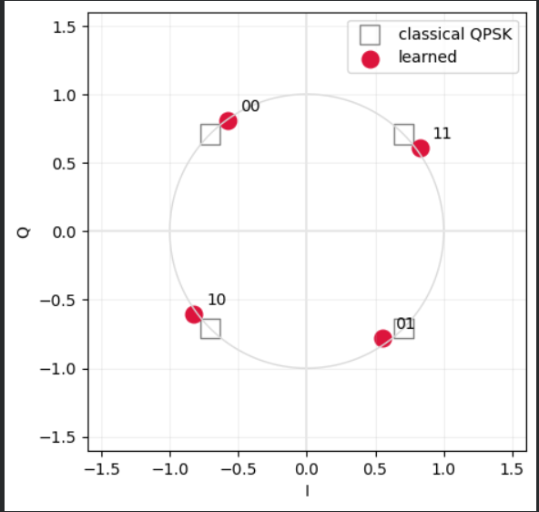
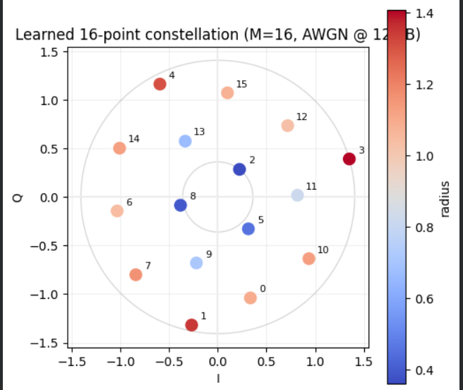

# Learned Physical Layer: Neural Networks Rediscover QPSK and APSK

An end-to-end neural communication system trained as an autoencoder over a noisy
channel. Given only a message to recover and an average transmit-power budget — no
knowledge of carriers, symbols, phase, or any modulation scheme — the network
independently arrives at the constellation geometries that classical communication
theory proves optimal.

On AWGN it converges to QPSK. Extended to 16 messages, it converges toward
APSK-style concentric rings, the geometry used by satellite standards such as
DVB-S2 under power-limited conditions.

---

## 1. Background: a communication system is an autoencoder

A digital communication link is:

```
message m → transmitter → x → channel → r = x + n → receiver → m̂
```

An autoencoder is:

```
input → encoder → latent z → bottleneck → decoder → reconstruction
```

These are the same diagram. The transmitter is an encoder, the **constellation is
the latent space**, the channel is a *noisy* bottleneck, and the receiver is a
decoder. The training objective — recover the input at the output — is the
communication objective.

The move that makes this trainable: the AWGN channel `r = x + n` is
**differentiable**. Because `n` is sampled independently of `x`, autograd treats it
as an additive constant, so `∂r/∂x = 1`. The channel injects randomness in the
forward pass but does not block gradient flow in the backward pass. Gradients travel
from the receiver's loss, *through the physics of the channel*, into the
transmitter's weights.

---

## 2. Setup

**Classical baseline (implemented first, in `src/baselines.py`).**
1M random bits → Gray-mapped to QPSK symbols (bit `0 → +1`, `1 → −1` on each of I
and Q), normalized so `Es = 1` → AWGN channel → nearest-neighbour detection → BER.
Simulated BER matches the theoretical `Q(√(2Eb/N₀))` curve, which validates the
transmitter, channel, and receiver before any learning is introduced.

Noise calibration used throughout:

```
Es = 1  →  Eb = Es / k  →  N₀ = Eb / (Eb/N₀)  →  σ² = N₀ / 2  per real dimension
```

**Learned system (`src/models.py`).**

| Stage | Object | Shape |
|---|---|---|
| Message | `m ∈ {0, …, M−1}` | scalar |
| One-hot `s` | selector, *not* a probability | `M` |
| Encoder MLP | transmitter | `M → 64 → 2·n_ch` |
| Power normalization | `E[‖x‖²] = n_ch` | — |
| Channel | `r = x + n` | `2·n_ch` |
| Decoder MLP | receiver | `2·n_ch → 64 → M` |
| Softmax | posterior `P(m ∣ r)` | `M` |

Trained end-to-end with cross-entropy. A single optimizer holds **both** networks'
parameters — transmitter and receiver are co-designed rather than standardized
separately.

### Two details that carry all the physics

**Why one-hot, not the integer `m`.** `Linear(1, ·)` computes `w·m + b`, which forces
message 2 to produce twice the pre-activation of message 1 — a false ordering and a
false metric on what are arbitrary categorical labels. With a one-hot input,
`Linear(M, ·)` instead *selects a column* of the weight matrix, making the first layer
a learnable lookup table: M free vectors, one per message. That is exactly what
designing a constellation means.

**Why the power constraint is the problem.** Without `E[‖x‖²] = 1`, the network
discovers it can defeat any noise by transmitting with unbounded amplitude. It does:
training loss collapses to `0.0000` (see §5). Real transmitters have batteries,
saturating amplifiers, and regulators. The constellation that emerges is the
**equilibrium between two opposing forces** — spread points far apart to minimize
confusion, but stay within a fixed energy budget. Remove the budget and the problem
evaporates.

**Why cross-entropy is the *correct* loss, not a default.** The decoder's softmax is
an estimate of the posterior `P(m ∣ r)`, and classical detection theory proves the
optimal receiver is the MAP detector: `argmax_m P(m ∣ r)`. Minimizing cross-entropy
drives the softmax toward the true posterior, so the trained decoder **is a learned
MAP detector** — the same object the textbook prescribes, reached by gradient descent
instead of algebra. Its learned decision regions are the Voronoi cells of the
constellation.

---

## 3. Results

### 3.0 Classical baseline: simulation matches theory


Simulated QPSK BER (1M bits, nearest-neighbour detection) sits on the analytical
`Q(√(2Eb/N₀))` curve across 0–10 dB. This validates the transmitter, channel model,
and noise calibration before any learning is introduced. Every result below is
measured against this verified pipeline.

*(Note the scatter at 9–10 dB: at BER ≈ 10⁻⁵ only a handful of errors occur in 10⁶
bits, so the Monte-Carlo estimate is noisy. Reliable estimates require counting
errors, not bits.)*

### 3.1 AWGN, M = 4 — QPSK is rediscovered



| Metric | Learned | Classical optimum |
|---|---|---|
| Mean symbol energy `E[‖x‖²]` | 1.000 | 1.000 (the constraint) |
| Minimum distance | ≈ 1.41 | √2 = 1.414 (QPSK) |

Four points, unit circle, 90° apart — QPSK, up to a global rotation. The rotation is
irrelevant: a constant phase offset is removed by carrier recovery in any real
receiver. The *geometry* is the result.

**The learned system does not beat classical QPSK on AWGN. It matches it.** This is
the expected and correct outcome — on AWGN the classical solution is provably
optimal, so there is nothing to beat. The value of the experiment is that it
validates the method on a channel where ground truth is known.

**Gray coding does not emerge.** The learned labels place `00` adjacent to `11`.
Cross-entropy penalizes *message* errors, not *bit* errors, and the one-hot encoding
destroys bit structure — to the loss, all 16 messages are equidistant categories. The
network therefore has no incentive to place bit-adjacent patterns at
geometry-adjacent points. Classical QPSK uses Gray labelling precisely because a
symbol error flipping two bits costs twice as much as one flipping a single bit.
Recovering this behaviour requires a per-bit loss (see roadmap).

### 3.2 AWGN, M = 16 — an APSK-like *local* optimum, below 16-QAM



The learned constellation organizes into **3 + 3 + 10** structure: three points near
the origin (r ≈ 0.36–0.45), three at mid-radius (r ≈ 0.67–0.82), and ten spread
around an outer region (r ≈ 1.03–1.41) at roughly 36° angular spacing. This is
ring-like — qualitatively APSK — but the radii within each group are **not tight**,
which is the signature of incomplete convergence.

Benchmarked against standard 16-point constellations, all normalized to unit average
energy:

| Constellation | Minimum distance |
|---|---|
| 16-QAM | **0.6325** |
| APSK 5+11 (radius-optimized) | 0.6214 |
| **Learned (this work)** | **0.611** |
| APSK 6+10 | 0.5898 |
| 16-APSK 4+12 (DVB-S2 style) | 0.5848 |
| 16-PSK | 0.3902 |

**The learned constellation underperforms 16-QAM by ~3% in minimum distance.** It
beats 16-PSK and the DVB-S2 4+12 APSK, but it did not find the best available
geometry. The most likely explanation is a local optimum: 16-point packing has many,
and rotationally symmetric ring solutions are easy attractors.

Two caveats that keep this honest in both directions:

1. **Minimum distance is not the training objective.** The network minimizes
   cross-entropy at 12 dB, i.e. error probability. By the union bound,
   `P(err) ≈ N_min · Q(d_min / 2σ)` — the *number* of nearest neighbours matters too,
   so a constellation with slightly smaller `d_min` but fewer confusable neighbours
   can still win on error rate. A direct BLER comparison against 16-QAM is the fair
   test and is not yet run (see roadmap).
2. **An earlier version of this analysis argued that rings should beat the square grid
   under an average-power constraint, on the grounds that QAM "wastes" budget on
   high-energy corner points.** The benchmark above refutes that: on AWGN, 16-QAM has
   the largest minimum distance. APSK's real advantage is not AWGN performance but
   **nonlinearity** — fewer distinct amplitude levels and lower PAPR, which matters
   when the power amplifier is driven near saturation (the reason DVB-S2 adopted it).
   That claim is testable on a clipping channel, and is the next experiment.

---

## 4. What this does **not** show

- **No gain over classical theory on AWGN.** See above. Any project claiming
  otherwise on a linear AWGN channel is either mismeasuring or comparing against a
  strawman baseline.
- **The channel is simulated, not real.** The entire method depends on `∂r/∂x` being
  computable. A real RF front end — antennas, amplifiers, atmosphere — is not
  differentiable, and you cannot call `.backward()` on hardware. This is *the* open
  problem of learned physical layers. The standard workarounds are (a) train a GAN to
  imitate the measured channel and backpropagate through the imitation, or (b) treat
  the transmitter as an RL policy with the receiver's loss as reward, avoiding
  `∂r/∂x` entirely. Neither is implemented here.
- **Small scale.** M ≤ 16, n_ch = 1, 2-layer MLPs. This demonstrates the principle;
  it is not a competitive coded system.

---

## 5. Failure modes (kept deliberately)

**Unconstrained power → zero loss.** Training the encoder without the normalization
layer produces:

```
step  2000   loss 0.0000
step  4000   loss 0.0000
...
```

Loss identically zero at 7 dB is impossible for any physical system. The network had
learned to scale `‖x‖` arbitrarily high, rendering the noise irrelevant — it
"solved" communication by transmitting with infinite power. The bug is instructive:
it demonstrates that the power constraint is not a numerical nicety but *the physics
of the problem*.

**Loss does not converge to zero (correctly).** With the constraint in place, loss
settles into a noisy band around TODO and stops improving. This is the irreducible
Bayes error of the channel at the training SNR. In communications ML, a non-zero loss
floor is the correct outcome, not a failure to converge.

---

## 6. Roadmap

- [ ] **BLER: learned vs 16-QAM at matched Eb/N₀.** Minimum distance is a proxy; error
      rate is the objective. Settles whether the M=16 result is genuinely worse or
      merely worse *by the wrong metric*.
- [ ] **Seed sweep at M=16.** Run 5+ seeds and report the distribution of converged
      geometries. If the 3+3+10 structure is not reproducible, the finding is about
      the optimization landscape, not the constellation.
- [ ] **Nonlinear channel (clipping amplifier).** Models a PA driven near saturation:
      magnitudes above a threshold are compressed, phase preserved. Classical theory
      has no clean optimum here — this is where a learned system can genuinely *win*,
      not merely match. It is also the direct test of whether the ring geometry the
      network prefers is *justified* rather than an artifact. Baseline must be
      classical QAM/QPSK *simulated through the same nonlinear channel*, not the AWGN
      theory curve, which would flatter it.
- [ ] **`n_ch = 2` → coding gain.** Two complex uses = a 16-point packing in ℝ⁴.
      High-dimensional sphere packing is where geometric intuition fails and
      optimization does not; expect a gain over the 2D constellation at equal Eb/N₀.
- [ ] **Per-bit loss ablation.** Replace M-way cross-entropy with per-bit BCE and test
      whether Gray-like labelling emerges.
- [ ] **Training-SNR sweep.** Train across 0–15 dB, evaluate each model over the full
      range. Too low and the constellation learns from noise; too high and there is no
      error signal to learn from.
- [ ] **Constant-envelope constraint ablation.** Per-symbol normalization
      (`x / ‖x‖`) instead of batch-mean forces all points onto a circle — a PSK-like
      solution by construction. Costly on AWGN; potentially advantageous on the
      clipping channel.

---

## 7. Repository

```
src/channels.py       AWGN and (planned) nonlinear channels — the only thing that varies
src/models.py         Encoder, Decoder
src/train.py          training loop, block error rate
src/baselines.py      classical QPSK/16-QAM simulated through ANY channel
experiments/          one script per result; every number is regenerable
notebooks/            exploratory work, including the failure above
results/              JSON for every figure and table in this README
```

`baselines.py` simulates the classical system *through the channel object under test*
rather than invoking a closed-form BER formula. On AWGN these agree. On a nonlinear
channel they do not, and using the formula would silently flatter the baseline.

## 8. References

T. O'Shea and J. Hoydis, "An Introduction to Deep Learning for the Physical Layer,"
*IEEE Transactions on Cognitive Communications and Networking*, 2017.

## Run

```bash
pip install -r requirements.txt
python experiments/exp1_awgn_qpsk.py
python experiments/exp2_awgn_16.py
```